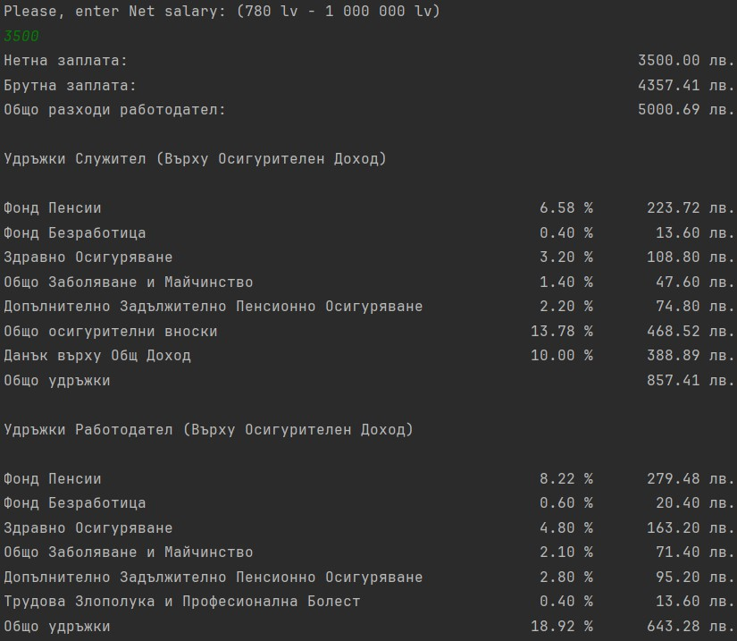

# Net to Gross Calculator

## Overview

The Net to Gross Calculator is a Java-based program that calculates employee and employer taxes based on a net salary input. The program provides detailed tax breakdowns and displays the net salary, gross salary, and total employer expenses.

## Features

- **Employee and Employer Taxes Calculation:** Calculates various employee and emplyer taxes.
- **User Input Validation:** Ensures that the net salary input is within a specified range.

## Usage

1. Run the Program from the Main class.
2. Enter Net Salary: Follow the prompt to enter a net salary. The program will then display the calculated taxes and salaries.

## Code Structure

### Classes:

1. **Main**: The entry point of the application.
2. **ProgramLauncher**: Handles the main logic of the program, including user input and the creation of tax objects.
3. **Abstract Taxes**: Defines common attributes and methods for calculating taxes.
4. **EmployeeTaxes**: Implementation for employee taxes.
5. **EmployerTaxes**: Implementation for employer taxes.
6. **UI**: Handles user input for the net salary.

## Example

